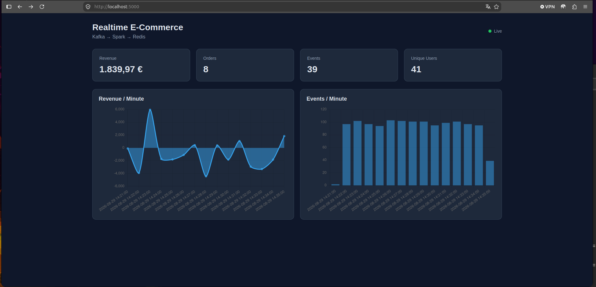

# Real-Time E-Commerce Data Platform

A real-time data engineering project demonstrating an end-to-end streaming architecture for e-commerce analytics.

The platform generates synthetic customer events, streams them through **Apache Kafka**, processes them with **Apache Spark Structured Streaming**, stores current metrics in **Redis**, and exposes them through a **Flask API** and web dashboard.

The project also includes a historical analytics architecture based on a **Data Lake, Delta Lake, and Databricks**.

## Architecture

### Real-Time Pipeline

```text
Python Event Producer
        │
        │ JSON events
        ▼
   Apache Kafka
        │
        ▼
Spark Structured Streaming
        │
        │ 1-minute windows
        ▼
      Redis
        │
        ▼
    Flask API
        │
        ▼
    Dashboard
```

### Historical Analytics

```text
Streaming / Raw Events
        │
        ▼
    Data Lake
        │
        ▼
      Bronze
        │
        ▼
      Silver
        │
        ▼
       Gold
        │
        ▼
   Delta Lake
        │
        ▼
   Databricks
        │
        ▼
Historical Analytics / BI
```

The two paths serve different workloads:

| Layer      | Purpose                        |
| ---------- | ------------------------------ |
| Kafka      | Event transport                |
| Spark      | Real-time stream processing    |
| Redis      | Low-latency current metrics    |
| Flask      | HTTP API and dashboard backend |
| Dashboard  | Real-time visualization        |
| Data Lake  | Durable historical storage     |
| Delta Lake | Reliable analytical storage    |
| Databricks | Historical analytics           |

## Technology Stack

| Component          | Technology                 |
| ------------------ | -------------------------- |
| Event Producer     | Python                     |
| Message Broker     | Apache Kafka               |
| Stream Processing  | Apache Spark 3.5.7         |
| Streaming API      | Spark Structured Streaming |
| Metrics Store      | Redis                      |
| Backend            | Flask                      |
| Frontend           | HTML / CSS / JavaScript    |
| Containerization   | Docker                     |
| Orchestration      | Docker Compose             |
| Historical Storage | Data Lake / Delta Lake     |
| Analytics          | Databricks                 |

## Project Structure

```text
realtime-ecommerce-platform/
├── producer/
│   ├── producer.py
│   └── requirements.txt
├── spark/
│   ├── streaming.py
│   ├── Dockerfile
│   └── requirements.txt
├── dashboard/
│   ├── app.py
│   ├── templates/
│   │   └── index.html
│   └── static/
│       ├── style.css
│       └── dashboard.js
├── docs/
│   └── dashboard.png
├── databricks/
│   └── notebooks/
├── docker-compose.yml
├── README.MD
└── requirements.txt
```

## Event Model

The producer generates synthetic e-commerce events.

Supported event types include:

* `view_product`
* `add_to_cart`
* `purchase`
* `refund`

Each event contains:

```json
{
  "event_id": "b5463552-84ed-4532-923d-7c0422ec1c69",
  "user_id": 425,
  "product_id": 3,
  "event_type": "purchase",
  "amount": 299.99,
  "timestamp": "2026-08-29T13:30:52.779863"
}
```

The event schema used by Spark is:

| Field        | Type      |
| ------------ | --------- |
| `event_id`   | STRING    |
| `user_id`    | INTEGER   |
| `product_id` | INTEGER   |
| `event_type` | STRING    |
| `amount`     | DOUBLE    |
| `timestamp`  | TIMESTAMP |

## Kafka

Apache Kafka acts as the central event streaming layer.

The main topic is:

```text
ecommerce-events
```

The current local configuration uses:

```text
Partitions:        3
Replication factor: 1
```

Kafka decouples event generation from event processing:

```text
Producer → Kafka → Spark
```

The producer does not need to know how Spark processes events, and Spark does not need to know how the events were generated.

## Event Producer

The Python producer continuously generates synthetic e-commerce activity and publishes the events to Kafka.

Run the producer with:

```bash
python3 producer/producer.py
```

Install dependencies with:

```bash
pip install -r producer/requirements.txt
```

or:

```bash
pip install kafka-python
```

## Spark Structured Streaming

Spark consumes events from Kafka and processes them continuously.

The streaming application:

1. Reads events from Kafka
2. Parses the JSON payload
3. Applies the event schema
4. Calculates revenue
5. Groups events into one-minute windows
6. Calculates streaming metrics
7. Writes the current metrics to Redis

### Revenue Calculation

Revenue depends on the event type:

```text
purchase  → +amount
refund    → -amount
view      → 0
cart      → 0
```

Conceptually:

```text
revenue =
    purchases
    - refunds
```

This allows the platform to calculate net revenue directly from the event stream.

## Windowed Metrics

Events are aggregated into one-minute windows.

The current metrics include:

* `window_start`
* `window_end`
* `revenue`
* `orders`
* `events`
* `unique_users`

Example:

```text
window_start    2026-08-29 14:05:00
window_end      2026-08-29 14:06:00
revenue         -459.93
orders          4
events          37
unique_users    38
```

For streaming-compatible unique-user estimation, the implementation uses:

```python
approx_count_distinct("user_id")
```

instead of the regular `countDistinct()` aggregation.

## Redis

Redis acts as the low-latency serving layer for the dashboard.

The current metrics are stored under:

```text
ecommerce:metrics
```

Stored fields include:

```text
revenue
orders
events
unique_users
window_start
window_end
```

Inspect the current metrics with:

```bash
docker exec ecommerce-redis redis-cli HGETALL ecommerce:metrics
```

Redis is intentionally used for current state rather than long-term historical storage.

## Flask API

The Flask application provides the interface between Redis and the dashboard.

Responsibilities include:

* Reading current metrics from Redis
* Providing metrics through HTTP
* Serving the dashboard
* Providing historical data where configured

The local dashboard/API is exposed at:

```text
http://localhost:5000
```

The browser communicates with Flask rather than accessing Redis directly:

```text
Browser
   │
   ▼
Flask API
   │
   ▼
Redis
   ▲
   │
Spark
```

This keeps Redis internal to the Docker environment.

## Dashboard

The dashboard visualizes the current streaming metrics.

It can display:

* Current revenue
* Number of orders
* Number of events
* Approximate unique users
* Current processing window

Dashboard screenshot:



## Data Lake

Redis provides fast access to current metrics but is not intended as the long-term storage layer.

The historical architecture separates durable storage from real-time serving:

```text
Kafka
  │
  ▼
Raw Event Storage
  │
  ▼
Bronze
  │
  ▼
Silver
  │
  ▼
Gold
  │
  ▼
Delta Lake
  │
  ▼
Databricks
```

### Bronze

Contains raw event data with minimal transformation.

### Silver

Contains cleaned and normalized events.

Typical transformations include:

* Schema validation
* Type conversion
* Timestamp normalization
* Duplicate handling
* Data-quality validation
* Invalid-event filtering

### Gold

Contains analytics-ready datasets.

Potential datasets include:

* `daily_revenue`
* `daily_orders`
* `product_sales`
* `customer_activity`
* `conversion_metrics`
* `refund_metrics`

## Databricks and Delta Lake

Databricks provides the historical analytics environment.

The architecture is designed to support:

* Delta Lake tables
* SQL analytics
* Data transformations
* Data-quality checks
* Notebooks
* Historical analysis
* Aggregations
* Business intelligence
* Machine-learning preparation

Example flow:

```text
Raw Events
    │
    ▼
Data Lake
    │
    ▼
Delta Tables
    │
    ▼
Databricks
    │
    ▼
Analytics
```

Delta Lake provides capabilities such as:

* ACID transactions
* Schema enforcement
* Schema evolution
* Time travel
* Batch processing
* Streaming ingestion

## Running the Platform

Build and start the Docker environment:

```bash
docker compose up -d --build
```

Check the services:

```bash
docker compose ps
```

The local environment contains services for:

```text
Kafka
Spark
Redis
Dashboard
```

Start the producer separately:

```bash
python3 producer/producer.py
```

The expected end-to-end flow is:

```text
Producer
   │
   ▼
Kafka
   │
   ▼
Spark Structured Streaming
   │
   ▼
1-Minute Metrics
   │
   ▼
Redis
   │
   ▼
Flask
   │
   ▼
Dashboard
```

## Monitoring and Debugging

A useful debugging order is:

```text
1. Docker
2. Kafka
3. Producer
4. Spark
5. Redis
6. Flask
7. Dashboard
```

### Check services

```bash
docker compose ps
```

### Check Spark logs

```bash
docker compose logs -f spark
```

### Check Kafka logs

```bash
docker compose logs --tail=50 kafka
```

### Check Redis

```bash
docker exec ecommerce-redis \
  redis-cli HGETALL ecommerce:metrics
```

### Check Kafka topic

```bash
docker exec ecommerce-kafka \
  /opt/kafka/bin/kafka-topics.sh \
  --bootstrap-server localhost:9092 \
  --describe \
  --topic ecommerce-events
```

## Common Issues

### `countDistinct` is not supported

Spark Structured Streaming does not support the regular distinct aggregation in this setup.

Use:

```python
approx_count_distinct("user_id")
```

instead.

### Redis cannot be resolved

If Spark reports a Redis connection or DNS error, verify that Spark and Redis are attached to the same Docker network.

```bash
docker network inspect realtime-ecommerce-platform_default
```

From the Spark container, connectivity can be tested with:

```bash
docker exec ecommerce-spark \
  python3 -c "import socket; print(socket.gethostbyname('redis')); print(socket.create_connection(('redis',6379,5)))"
```

### Kafka topic is missing

Inspect the topic:

```bash
docker exec ecommerce-kafka \
  /opt/kafka/bin/kafka-topics.sh \
  --bootstrap-server localhost:9092 \
  --describe \
  --topic ecommerce-events
```

### Python Kafka dependency is missing

Install the producer dependencies:

```bash
pip install -r producer/requirements.txt
```

## Streaming Checkpoints

The Spark application uses a checkpoint directory for streaming state and offsets.

The current local configuration uses:

```text
/tmp/checkpoints/ecommerce
```

For a production deployment, checkpoints should be stored on persistent storage or object storage rather than a temporary container filesystem.

Examples:

```text
/data/checkpoints/ecommerce
s3://...
abfss://...
gs://...
```

## Production Considerations

The current project is designed primarily as a portfolio and learning project.

A production deployment would require additional infrastructure and operational safeguards.

### Kafka

* Higher replication factor
* Retention configuration
* Partition tuning
* Monitoring
* Authentication
* TLS

### Spark

* Persistent checkpoints
* Watermarking
* State management
* Structured logging
* Resource configuration
* Monitoring

### Redis

* Persistent storage
* Authentication
* High availability
* Memory policies

### Flask

* Production WSGI server
* Authentication
* Rate limiting
* API versioning
* Structured logging

### Dashboard

* Authentication
* Error handling
* Historical charts
* WebSocket/SSE updates
* Alerting

### Data Lake

* Object storage
* Partitioning
* Schema evolution
* Data-quality checks
* Governance

### Databricks

* Workflows
* Unity Catalog
* Job orchestration
* Data-quality monitoring
* SQL Warehouses

## Example Business Metrics

The event model allows the platform to support metrics such as:

### Revenue

```text
Purchases - Refunds
```

### Orders

Number of purchase events.

### Events

Total number of events.

### Unique Users

Approximate number of unique users within the aggregation window.

### Conversion Rate

```text
purchases / product_views
```

### Refund Rate

```text
refunds / purchases
```

### Average Order Value

```text
revenue / orders
```

Historical versions of these metrics can be calculated from the Data Lake / Gold layer.

## Future Extensions

Possible extensions include:

* Persistent Data Lake ingestion
* Delta Lake Bronze/Silver/Gold tables
* Databricks notebooks
* Databricks Workflows
* Product-level analytics
* Customer-level analytics
* Conversion funnels
* Revenue forecasting
* Fraud detection
* Real-time alerts
* Prometheus / Grafana monitoring
* Kubernetes deployment
* Cloud deployment
* CI/CD
* Automated data-quality tests

## Project Goals

This project demonstrates practical experience with:

* Event-driven architecture
* Real-time data streaming
* Apache Kafka
* Spark Structured Streaming
* Windowed stream processing
* Redis
* REST APIs
* Docker
* Docker Compose
* Data Lake architecture
* Medallion architecture
* Delta Lake
* Databricks
* SQL analytics
* Data quality
* Streaming debugging

The main goal is to demonstrate an **end-to-end data platform**, from event generation and streaming ingestion to real-time processing, low-latency serving, and historical analytics.

## Current Status

The currently demonstrated real-time pipeline is:

```text
Python Producer
      │
      ▼
Apache Kafka
      │
      ▼
Spark Structured Streaming
      │
      ▼
1-Minute Metrics
      │
      ▼
Redis
      │
      ▼
Flask API
      │
      ▼
Dashboard
```

The historical analytics architecture extends this with:

```text
Streaming Events
      │
      ▼
Data Lake
      │
      ▼
Delta Lake
      │
      ▼
Databricks
      │
      ▼
Historical Analytics
```

## Summary

This project demonstrates a modern streaming architecture for real-time e-commerce analytics.

It combines:

**Kafka** for event transport,
**Spark Structured Streaming** for processing,
**Redis** for low-latency metrics,
**Flask** for the API,
**Docker** for reproducible deployment, and
**Data Lake / Delta Lake / Databricks** for historical analytics.

The result is a complete portfolio project covering both **real-time data engineering** and **historical analytical workloads**.

